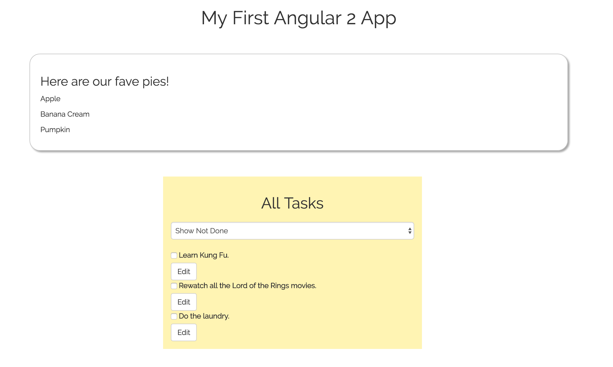

# To-Do List (Angular2)

#### _10-18-16_

#### By _**Aimen Khakwani &amp; Molly LeCompte**_

## Description

A web to-do list that allows users to add tasks, edit, or mark them as complete/incomplete.

## Setup/Installation Requirements

* Clone the repository
* Using the command line, navigate to the project's root directory
* Run the following commands to start browser:
  * $ npm install
  * $ bower install
  * $ gulp build
  * $ gulp serve

## Known Bugs

_None_

## Technologies Used

_HTML,
CSS,
JavaScript,
Node,
Angular 2,
Bootstrap
jQuery_

### License

*This webpage is licensed under the MIT license.*

Copyright (c) 2016 **_Aimen Khakwani &amp; Molly LeCompte_**
